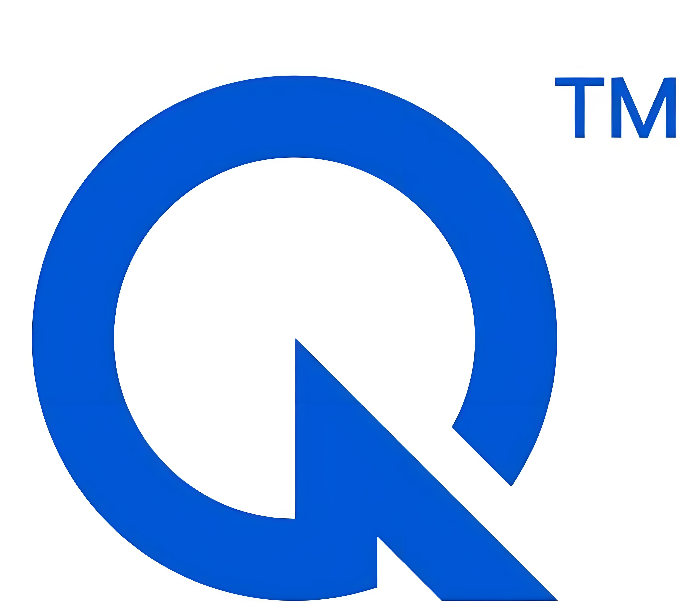
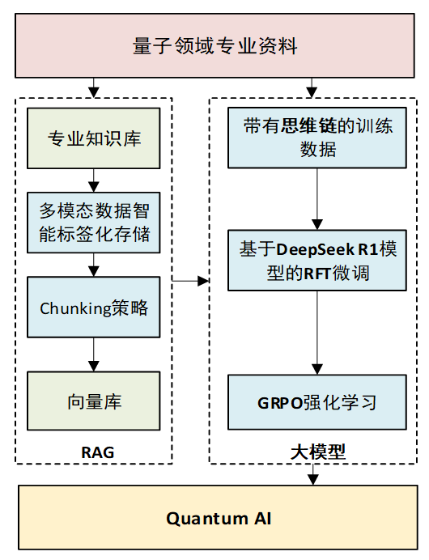

# Quantum AI-量子AI智能体

<p align="center">
    
  </a>


**量子AI智能体** 是一个面向量子科学领域的专业检索新引擎，集成了大语言模型的强大认知能力与RAG（检索增强生成）技术的精准知识获取优势，旨在为量子领域的科研与应用提供高效、精准且可扩展的智能支持。 

## ✨ 主要功能

- 多模态知识问答: 支持文本、图像、公式等多维度数据的融合推理，提供图文并茂的精准问答服务。 
- 深度学术洞察:能够结合论文知识对图像和图表进行深入分析，理解复杂专业信息。 
- 精准知识溯源: 对生成的答案，能够精准溯源到相关的学术文献，保证内容的可信度。 
- 动态知识库扩展: 支持私有化部署和领域知识库的动态扩展，适应不断增长的科研需求。 
- 友好的交互体验:提供简洁明了的用户界面，支持历史对话搜索与管理。 

## 🛠️ 技术栈

- 前端: Vue.js 
- 后端: FastAPI
- 基座模型: QWQ (当前为 32B 版本) 
- 核心技术: RAG (检索增强生成), 多模态模型融合, 定制化微调 
- 向量数据库/检索: FAISS
- 知识库: 当前覆盖约300篇论文，目标扩展至50万+篇量子领域文献。 

## 🚀 架构与技术路线

本项目旨在解决传统大模型在专业领域应用中的幻觉问题和多模态信息处理难题。我们的核心技术路线如下：

**1.多模态输入处理:**

​        针对QWQ-32B纯文本模型的局限，我们引入了多模态模型，结合其解析能力和推理能力，实现对图、表、公式等信息的精准理解。 

**2.多模态输出生成:**

​     通过多模态数据智能标签化存储方案，实现跨模态数据检索。结合改进的 RAG 模型，确保输出的图文内容逻辑一致且高度匹配。 

**3.RAG 优化:**

- Chunking 策略优化:确保图片与其上下文在同一数据块内，增强图文关联性。 
- 相似度检索算法改进:提升在复杂场景下的检索准确性。 

**4.定制化微调:**

​         基于量子领域知识对模型进行微调，并通过全链路提示词工程，确保模型回答的专业性、准确性并遵循学术规范。 

**5.技术路线图：**

<p align="center">
    
  </a>

## 📋 安装依赖

在终端中输入下面的命令，然后回车即可。

```python
pip install -r requirements.txt
```

## Quick start

```python
bash deploy_models.sh

python qwen_rag.py
```

## ✨体验

- http://123.57.18.29:8281，有需要请联系我们开启服务

## 免责声明

请各位严格遵守如下约定：

1.本项目任何资源**可供学术研究使用，若有商业用途需求请联系我们 canaanleen@163.com**。

2.模型输出受多种不确定性因素影响，本项目当前无法保证其准确性，**严禁用于真实场景**。

3.本项目不承担任何法律责任，亦不对因使用相关资源和输出结果而可能产生的任何损失承担责任。

## 🤝 贡献

我们欢迎任何形式的贡献！无论是发起 Pull Request还是改进文档。

## 致谢

本项目参考了以下开源项目，在此对相关项目和研究开发人员表示感谢。

MatChat材料科学AI智能体：[MatChat AI平台](https://matchat.cn/)

Easy Dataset ：https://github.com/ConardLi/easy-dataset

LangChain：https://github.com/langchain-ai/langchain

MarkItDown：https://github.com/microsoft/markitdown


